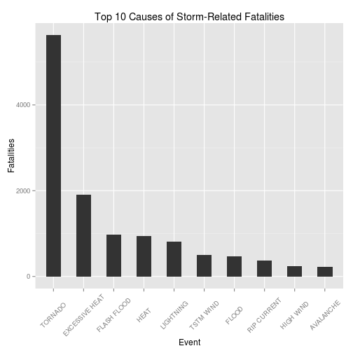
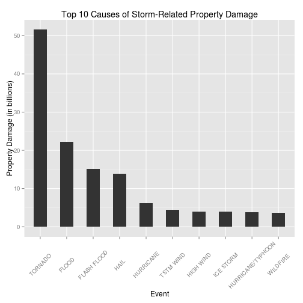
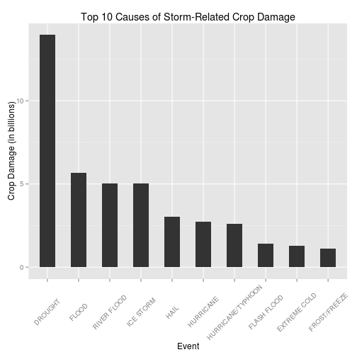

## Tornadoes, Floods, Drought and Ice - The Impact of Storms on the Health and Economy of the USA

Storms may cause both health and economic problems for communities, resulting in fatalities, injuries and property and crop damage. Data on storms and severe weather has been tracked by the U.S. National Oceanic and Atmospheric Administration (NOAA) in their storm database, storing characteristics of major storms and weather events in the United States. An analysis of this data was performed to determine the leading causes of storm-related health and economic damage. It was found that tornadoes are the leading cause of health-related storm damage, and also the primary cause of property damage caused by storms, with floods the next largest factor. The largest effect on crop damage was seen to be from drought with floods and ice being the next largest factors.

## Data Processing
Both the **plyr** and **ggplot2** libraries were used in this analysis.


```r
library(plyr)
library(ggplot2)
```

The first step was to load the original bzipped file into R. This dataset represents the storm data recorded by the NOAA, starting in the year 1950 and ending in November 2011.


```r
setwd("~/GitHub/RepData_PeerAssessment2")
data<-read.csv(bzfile("data/repdata-data-StormData.csv.bz2"),header=TRUE)
```

The initial dataset consisted of 902297 rows and 37 columns.
For this analysis, there were only a small number of the variables required from the original dataset, EVTYPE which indicates the type of the event, FATALITIES and INJURIES which store the number of fatalities and injuries associated with the event, respectively, and the variables PROPDMG and CROPDMG indicating the property and crop damage caused by the event. Two further variables, PROPDMGEXP and CROPDMGEXP, indicate the scale of the property and crop damages, indicating the corresponding damage variable is in the range of hundreds, thousands, millions or billions. The variables of interest were extracted, and the original dataset was deleted.


```r
stormData<-data[,c("EVTYPE","FATALITIES","INJURIES","PROPDMG","PROPDMGEXP","CROPDMG","CROPDMGEXP")]
data<-NULL
```

Transforming the PROPDMG and CROPDMG by their respective scale variables was performed in order to accurately determine their impact. Values in the order of thousands or above only were considered for this analysis, all other multipliers were ignored. It should be noted that there were many typographical errors in this column.


```r
stormData$PROPDMG <- ifelse(stormData$PROPDMGEXP %in% c("k","K"),stormData$PROPDMG * 1000,    
     ifelse(stormData$PROPDMGEXP %in% c("m","M"),stormData$PROPDMG * 1000000,
          ifelse(stormData$PROPDMGEXP %in% c("b","M"),stormData$PROPDMG * 1000000000,  
            stormData$PROPDMG))) 

stormData$CROPDMG <- ifelse(stormData$CROPDMGEXP %in% c("k","K"),stormData$CROPDMG * 1000,
       ifelse(stormData$CROPDMGEXP %in% c("m","M"),stormData$CROPDMG * 1000000,
               ifelse(stormData$CROPDMGEXP %in% c("b","B"),stormData$CROPDMG * 1000000000,
                      stormData$CROPDMG)))
```

As there were many cases of each event type, the plyr library's ddply function was used to group the records by event type thereby giving the total for each one. Column names were also changed for display purposes. The data was now at a point where analysis could begin. 


```r
summedStormData<-ddply(stormData,~EVTYPE,summarise,Fatalities=sum(FATALITIES),Injuries=sum(INJURIES), 
PropertyDamage=sum(PROPDMG),CropDamage=sum(CROPDMG))
colnames(summedStormData)<-c("EventType","Fatalities","Injuries","PropertyDamage","CropDamage")
stormData<-NULL
```


## Results
An initial analysis was performed on health related damage due to storms.
The data was sorted on the number of fatalities in descending order, and a display of the top ten results indicates a large lead between the number of fatalities caused by tornadoes and any of the other events.


```r
summedStormData<-arrange(summedStormData,desc(summedStormData$Fatalities))
fatalitiesData<-summedStormData[1:10,c("EventType","Fatalities")]
fatalitiesData
```

```
##         EventType Fatalities
## 1         TORNADO       5633
## 2  EXCESSIVE HEAT       1903
## 3     FLASH FLOOD        978
## 4            HEAT        937
## 5       LIGHTNING        816
## 6       TSTM WIND        504
## 7           FLOOD        470
## 8     RIP CURRENT        368
## 9       HIGH WIND        248
## 10      AVALANCHE        224
```

A plot of the top ten causes of storm-related fatalities illustrates this lead for tornadoes as the leading cause.


```r
g<-ggplot(fatalitiesData, aes(x=reorder(EventType, -Fatalities), y=Fatalities)) 
g<-g + geom_bar(stat="identity",width=.5)
g<-g + labs(x="Event", y="Fatalities", title="Top 10 Causes of Storm-Related Fatalities") 
g + theme(axis.text.x  = element_text(angle=45, vjust=0.5))
```

 

The data was processed similarly for storm-related injuries, and again the leading cause was seen to be tornadoes. The graph for this data is similar to that for fatalities and is not displayed in this report.


```r
summedStormData<-arrange(summedStormData,desc(summedStormData$Injuries))
injuriesData<-summedStormData[1:10,c("EventType","Injuries")]
injuriesData
```

```
##            EventType Injuries
## 1            TORNADO    91346
## 2          TSTM WIND     6957
## 3              FLOOD     6789
## 4     EXCESSIVE HEAT     6525
## 5          LIGHTNING     5230
## 6               HEAT     2100
## 7          ICE STORM     1975
## 8        FLASH FLOOD     1777
## 9  THUNDERSTORM WIND     1488
## 10              HAIL     1361
```

Analysis was also performed on the economic damage caused by storms.
The dataset was sorted based on the property damage score, and analysed as before. For ease of comparison and display purposes, the property damage values were expressed in billions.  Once again tornadoes were seen as the leading cause of damage, with flooding in second place, split between flood and flash flood categories.


```r
summedStormData<-arrange(summedStormData,desc(summedStormData$PropertyDamage))
propDamageData<-summedStormData[1:10,c("EventType","PropertyDamage")]
propDamageData$PropertyDamage <- propDamageData$PropertyDamage/1000000000
propDamageData
```

```
##            EventType PropertyDamage
## 1            TORNADO         51.637
## 2              FLOOD         22.158
## 3        FLASH FLOOD         15.141
## 4               HAIL         13.932
## 5          HURRICANE          6.168
## 6          TSTM WIND          4.485
## 7          HIGH WIND          3.970
## 8          ICE STORM          3.945
## 9  HURRICANE/TYPHOON          3.806
## 10          WILDFIRE          3.725
```

This pattern may also be displayed graphically.


```r
g<-ggplot(propDamageData, aes(x=reorder(EventType, -PropertyDamage), y=PropertyDamage))
g<-g + geom_bar(stat="identity",width=.5) 
g<-g + labs(x="Event", y="Property Damage (in billions)", title="Top 10 Causes of Storm-Related Property Damage")
g + theme(axis.text.x  = element_text(angle=45, vjust=0.5))
```

 

Lastly, the data was sorted by the crop damage score. Similarly to the property damage scores, the crop damage scores were expressed in billions for ease of analysis and display. Unlike the other damage indicators, where tornadoes were the leading cause, drought was found to be the largest cause of crop damage followed by flooding, split between flood and river flood categories, and ice damage, split between the ice storm and hail categories.


```r
summedStormData<-arrange(summedStormData,desc(summedStormData$CropDamage))
cropDamageData<-summedStormData[1:10,c("EventType","CropDamage")]
cropDamageData$CropDamage <- cropDamageData$CropDamage/1000000000
cropDamageData
```

```
##            EventType CropDamage
## 1            DROUGHT     13.973
## 2              FLOOD      5.662
## 3        RIVER FLOOD      5.029
## 4          ICE STORM      5.022
## 5               HAIL      3.026
## 6          HURRICANE      2.742
## 7  HURRICANE/TYPHOON      2.608
## 8        FLASH FLOOD      1.421
## 9       EXTREME COLD      1.293
## 10      FROST/FREEZE      1.094
```

This leading incidence of drought followed by floods and then ice as crop damage causes may be illustrated graphically as below.


```r
g<-ggplot(cropDamageData, aes(x=reorder(EventType, -CropDamage), y=CropDamage)) 
g<-g + geom_bar(stat="identity",width=.5)
g<-g + labs(x="Event", y="Crop Damage (in billions)", title="Top 10 Causes of Storm-Related Crop Damage")
g + theme(axis.text.x  = element_text(angle=45, vjust=0.5))
```

 

## Further Analysis
During the course of this analysis, the various storm categories were considered in the format they existed in the original dataset. From observations of the data, there seems to be some ambiguity and duplication of the categories, as seen in the anlysis of crop damage where there are separate flood, river flood and flash flood categories. Similar patterns were seen for wind, heat, drought ...etc. Additional analysis after a cleanup of the data, with similar categories grouped together, could prove informative.

In addition, analysis could be performed whereby fatalities and injuries are grouped together to obtain a single health damage score, and likewise for a grouping of crop and property damages to obtain a single economic damage score.


